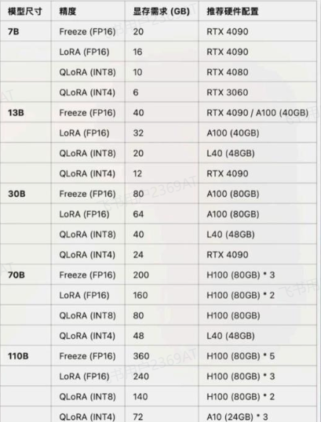
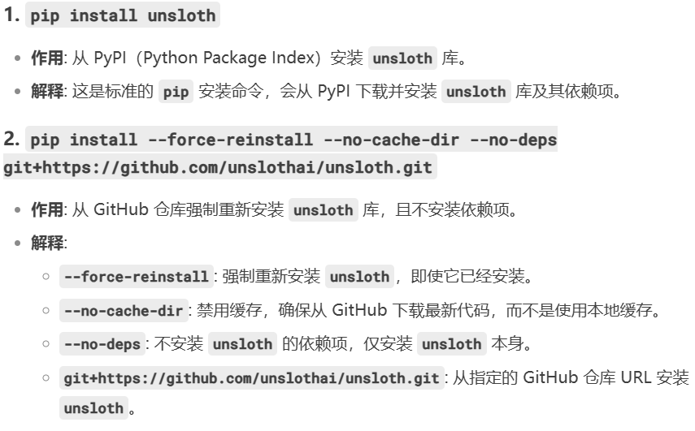

# deepseek-fine-tuning
硬件要求
//首先准备环境
1. 微调工具unsloth:https://github.com/unslothai/unsloth
安装命令：
pip install unsloth
pip install --force-reinstall --no-cache-dir --no-deps git+https://github.com/unslothai/unsloth.git

2. wandb安装与注册
pip install wandb

3. DeepSeek R1 Distill Qwen 7B模型下载
mkdir ./DeepSeek-R1-Distill-Qwen-7B
modelscope download --model deepseek-ai/DeepSeek-R1-Distill-Qwen-7B --local_dir ./DeepSeek-R1-Distill-Qwen-7B

4. 数据集下载
数据集medical-o1-reasoning-SFT
我们从魔搭社区下载：https://www.modelscope.cn/datasets/FreedomIntelligence/medical-o1-reasoning-SFT/
from modelscope.msdatasets import MsDataset
ds =  MsDataset.load('FreedomIntelligence/medical-o1-reasoning-SFT')

deepseek-qwen-r1  调用模型进行推理

deepseek_fine_tune 调用模型进行微调